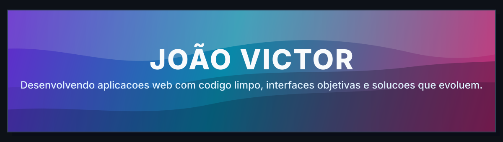

<p align="center">
  
</p>

<p align="center">
  <code>Construindo produtos que resolvem problemas reais.</code>
</p>

---

## Sobre mim

```php
<?php

class JoaoVictor
{
    public string $role = 'Desenvolvedor em formacao';
    public string $location = 'Brasil';

    public array $stack = [
        'PHP', 'Laravel', 'JavaScript', 'React', 'Vue', 'Node.js', 'Redis'
    ];

    public array $focus = [
        'Interfaces objetivas',
        'APIs bem estruturadas',
        'Projetos organizados e evolutivos'
    ];
}
```

---

## Tecnologias & Ferramentas

<p align="left">
  
  
  
  
  
  
  
</p>

---

## Resumo do GitHub

<!--START_SECTION:github-metrics-->
- Repositorios publicos: **38**
- Projetos proprios: **38**
- Commits publicos: **790**
- Linguagem mais usada: **PHP**
<!--END_SECTION:github-metrics-->

---

## Projetos recentes

<!--START_SECTION:featured-projects-->
- [martinss08](https://github.com/martinss08/martinss08) - JavaScript - Projeto em evolucao
- [teste-jungle-gaming](https://github.com/martinss08/teste-jungle-gaming) - TypeScript - Projeto em evolucao
- [teste-front-developer-JungleGaming](https://github.com/martinss08/teste-front-developer-JungleGaming) - Codigo - Projeto em evolucao
<!--END_SECTION:featured-projects-->

---

## Contato

Aberto a conversar sobre desenvolvimento web, backend e projetos em evolucao.
